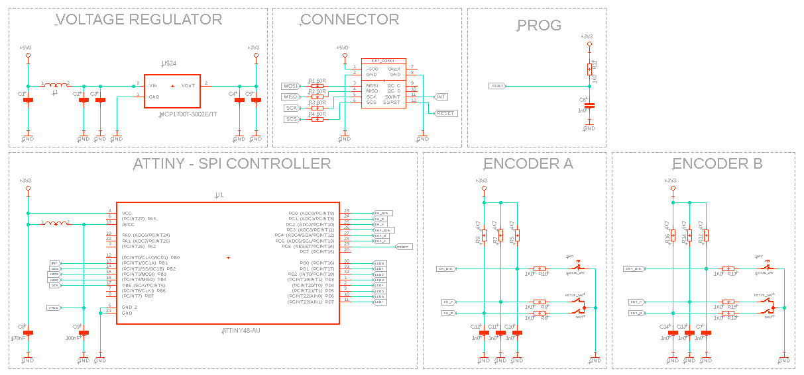
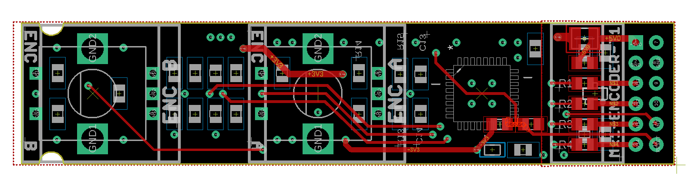
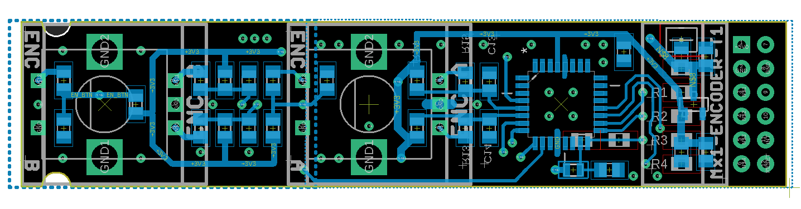
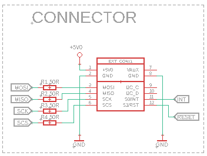

# Dual Encoder Module with ATtiny48

## Overview
This repository is dedicated to the design and implementation of a Dual Encoder Module, featuring two EC12E24204A8 encoders interfaced with an ATtiny48 microcontroller. Designed as an expansion module for the smartboard, it connects via a single smartboard connector, providing precise rotational input control for a wide range of applications.

## Key Features
- **Dual EC12E24204A8 Encoders**: High-quality rotary encoders for accurate and reliable input.
- **ATtiny48 Microcontroller**: Efficiently decodes and manages encoder signals.
- **SPI/UART Communication**: Offers flexible data transfer options to suit different requirements.
- **Smartboard Compatibility**: Easily integrates with smartboard systems through a dedicated connector.
- **Programmable via Connector Signals**: Enables easy programming and configuration.

